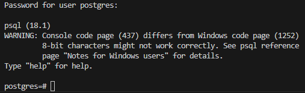
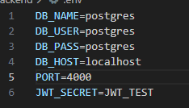
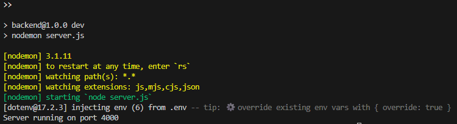
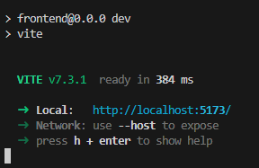
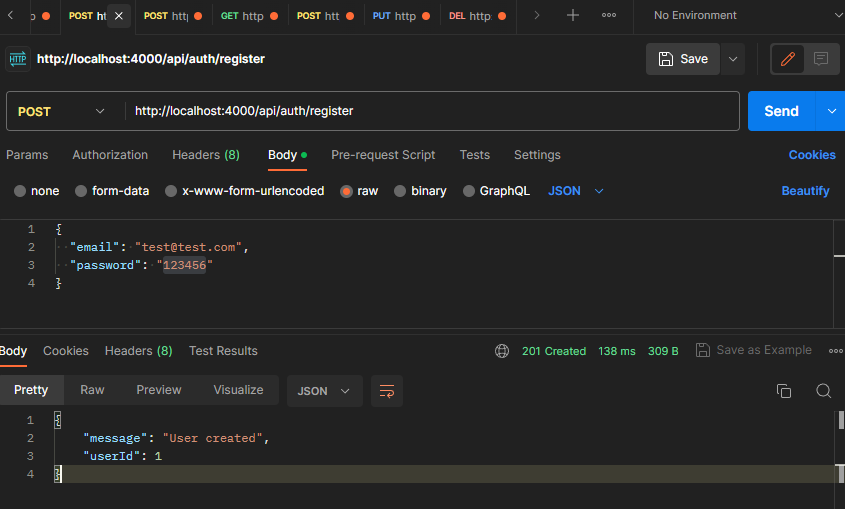
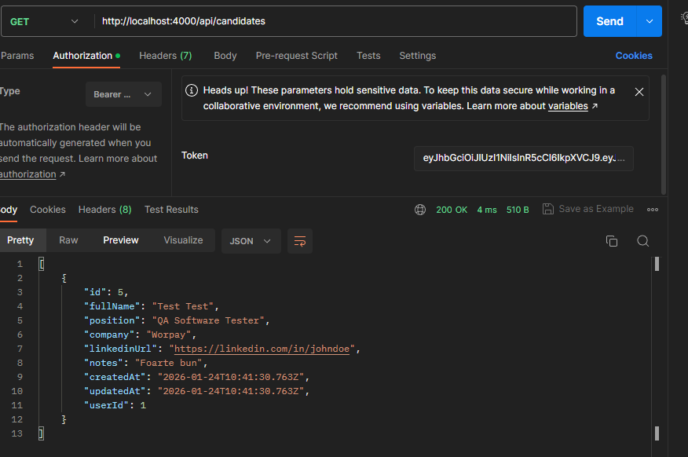
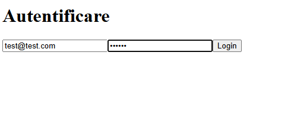
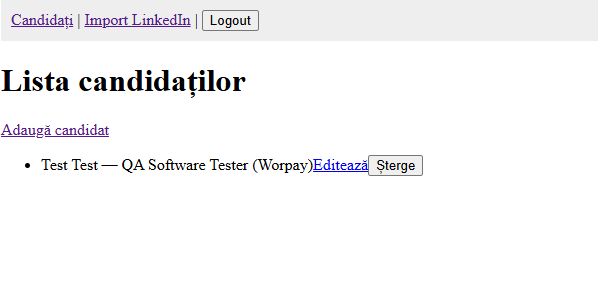

### BadescuAlexandru_ProiectTW25
Proiect Tehnologii Web 2025

### Gestionare profile candidati integrat cu LinkedIn (sau aplicare la un job)

## Descriere:
Aplicația permite gestionarea profilelor candidaților (creare, vizualizare, actualizare, ștergere) și integrarea (opțională) cu un serviciu extern de tip LinkedIn pentru import/sincronizare limitată de date publice (nume, poziție, companie, URL profil). Frontend-ul este o Single Page Application (SPA) construită cu un framework bazat pe componente (ex: React.js) iar backend-ul expune un API RESTful care persistă datele într-o bază relațională sau nerelațională, accesată printr-un API de persistență (ORM).

## Stack:  

 Backend: Node.js + Express.js — RESTful API

 ORM: Sequyelize 

 Bază de date: PostgreSQL (relațional)

 Autentificare: JWT (JSON Web Tokens) + OAuth2 

 Frontend: React.js (CRA / Vite) cu React Router

 Instrumente: Postman / HTTPie / REST Client

## Specificații:

- Implementare: modelare entity în ORM și migrații/seed pentru date inițiale.

- Răspunsuri JSON, validare input, gestionare erori cu coduri HTTP standard.

- Consumul API-ului cu fetch/axios, afișare liste, formulare create/update, paginare simplă.

- Autentificare prin JWT: POST /api/auth/login returnează token; token trimis în Authorization: Bearer token.

- Integrarea: LinkedIn (OAuth2) pentru autorizare și apel la API prin folosirea unui serviciu placeholder.

# Pasi pentru Rularea proiectului 

- 1. Se cloneaza repo-ul local
- 2. Se instaleaza Postgres pentru OS-ul folosit: https://www.enterprisedb.com/downloads/postgres-postgresql-downloads
- 3. Te asiguri ca baza de date e pornita cu comanda: 
    psql -U postgres -d postgres -h localhost
    
  

- 4. Din interiorul proiectului se ruleaza pe rand :
    - cd backend
    - npm install
    - se creaza un fisier .env in backend/de forma: 
     
  

    - se ruleaza npm run dev 
    - Serverul trebuie sa ruleze si sa afiseze urmatoarele:
     
  

    - cd .., 
    - cd frontend
    - npm install 
    - npm run dev 
     
  

- 5. se poate testa prin Postman ruland rutele implementate:

  
 

  

- 6. se poate accesa linkul http://localhost:5173/ creat local din urma rulari in /frontend
- 7. Te va duce pa pagina de autentificare: 

  

- 8. Dupa Login se va putea interactiona cu metodele implementate

  
